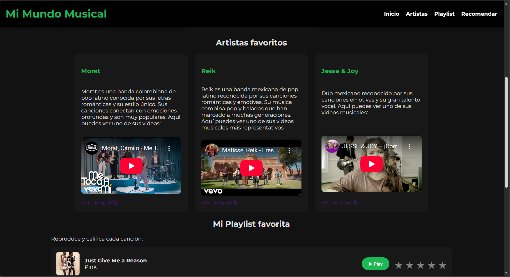
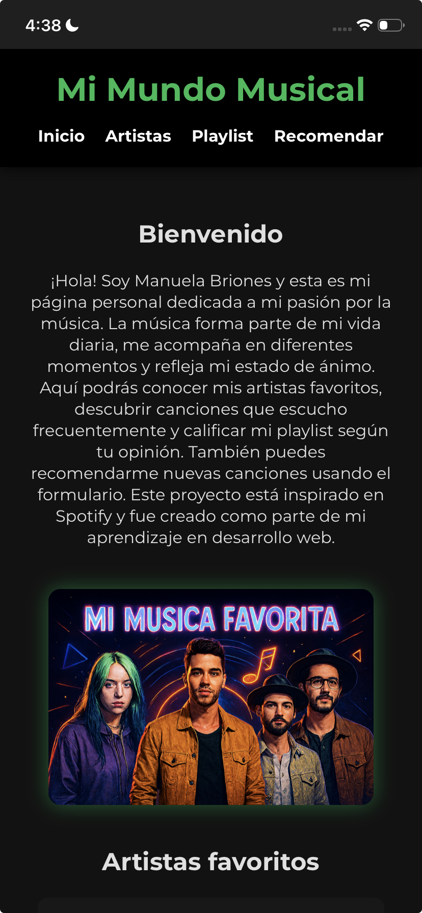
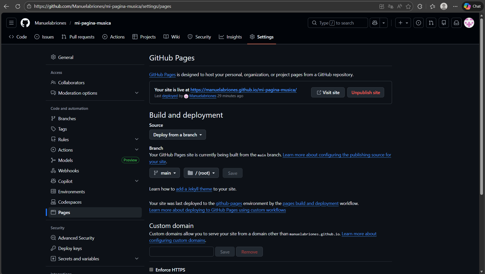

# Evidencias del Proyecto

## URL del repositorio

https://github.com/Manuelabriones/mi-pagina-musica

## URL de GitHub Pages

https://manuelabriones.github.io/mi-pagina-musica/

## Capturas

### Vista Desktop

### Vista Móvil

### GitHub Pages (Settings)

## Aprendizajes

### 1. ¿Qué fue lo más fácil y lo más retador?

Lo más fácil fue crear la estructura base utilizando HTML y organizar el contenido con etiquetas semánticas.

Lo más retador fue implementar la reproducción de audio, el sistema de calificación con estrellas y lograr que el diseño fuera responsive en diferentes tamaños de pantalla.

### 2. ¿Qué partes de HTML semántico y Flexbox usaste y por qué?

Utilicé etiquetas semánticas como:

* `header` para el encabezado y navegación
* `main` para el contenido principal
* `section` para dividir las secciones
* `article` para los artistas
* `footer` para la parte final

También utilicé Flexbox para:

* Alinear el menú de navegación
* Organizar las tarjetas de artistas
* Distribuir los elementos de la playlist
* Alinear el formulario

Esto permitió una mejor organización visual y estructura del sitio.

### 3. ¿Cómo organizaste tus media queries y breakpoints?

Utilicé media queries para adaptar el diseño a diferentes tamaños de pantalla:

* 768px para tablets
* 480px para dispositivos móviles

Con esto logré que el header, las tarjetas, la playlist y el formulario se acomodaran correctamente en pantallas pequeñas.

### 4. ¿Qué mejorarías en una siguiente versión?

Me gustaría mejorar aún más la experiencia responsive, agregar animaciones más avanzadas y optimizar el diseño visual para que sea más moderno y dinámico.

## Autor

Manuela Briones Vela